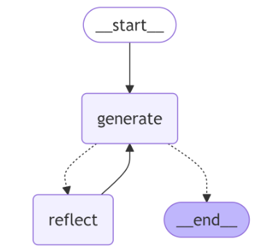

# Reflection using langGraph

## Description
LangGraph to iterate over an input until LLM is happy with the output. Embedd Mermaid in message digest.

## Installation
To install the necessary dependencies, run:
```sh
pip install poetry
poetry install
```

# Embedd Mermaid in message digest



## Usage
To use this project, follow these steps:

Import the necessary modules.
Initialize the LangGraph.
Iterate over the input until the desired output is achieved.
Update HumanMessage in `main.py` and run the main python class. 
Example:
```shell
poetry run python main.py
```

## Features
Iterates over input until the desired output is achieved.

## Contributing
Contributions are welcome! Please fork the repository and submit a pull request.

## Contact
For any questions or inquiries, please contact Sonika at sonika.janagill@gmail.com.
